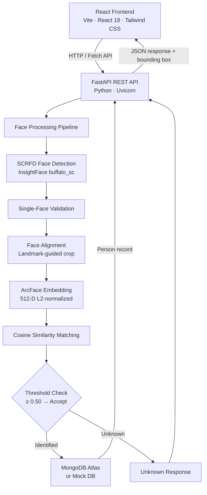

# Face Recognition Identification System

A full-stack AI face recognition and person management system built with FastAPI, InsightFace, ONNX Runtime, MongoDB Atlas, and React. The system supports face enrollment with duplicate detection, real-time live identification, upload and snapshot identification modes, people management, session recognition history, and configurable similarity thresholds.

---

## 🌟 Key Features

### 🧠 Core AI & Computer Vision

- **SCRFD Face Detection** — Fast, accurate face detection via InsightFace's SCRFD model at 640×640 detection resolution
- **ArcFace Embeddings** — 512-dimensional L2-normalized feature vectors for face representation
- **Single-Face Enforcement** — Every enrollment and identification request requires exactly one detectable face; images with zero or multiple faces are rejected with a descriptive error
- **Cosine Similarity Matching** — Query embeddings are compared against enrolled vectors using cosine similarity with configurable threshold-based unknown rejection
- **Duplicate Enrollment Prevention** — Before saving a new person, the embedding is compared against all existing records; faces that match above the duplicate threshold are rejected

### ⚡ FastAPI Backend

- **REST API** — Clean, versioned endpoints under `/api/v1/faces/` for enrollment, identification, listing, retrieval, and deletion
- **Dual Database Mode** — Switch between `DATABASE_MODE=mongodb` (MongoDB Atlas with PyMongo) and `DATABASE_MODE=mock` (thread-safe in-memory store for isolated testing) via environment variable
- **Structured Error Responses** — All errors return consistent JSON with `success`, `error`, and `detail` fields
- **Interactive Docs** — Auto-generated Swagger UI at `/docs` and ReDoc at `/redoc`
- **Embedding Privacy** — 512-D face embeddings are never included in API responses

### 🎨 Modern React Frontend

- **Live Recognition** — Continuous webcam stream with automatic frame sampling (no manual capture button); configurable interval from 300 ms to 1 200 ms
- **Bounding Box HUD** — Real-time percentage-mapped overlay on the video feed showing recognized identity (green) or unknown face (amber)
- **Upload & Snapshot Modes** — Single-image identification via file upload or manual webcam capture
- **Dashboard** — System health indicator, enrolled-person count, and recent session activity
- **Enrollment Page** — File upload or camera capture with real-time validation feedback
- **People Database** — Browse, search, and delete enrolled individuals with per-person detail views
- **Recognition History** — Session audit log with throttled writes to avoid duplicate entries
- **Settings** — Configurable similarity threshold slider and camera device selection

---

## 🏗️ System Architecture



---

## 🔍 How It Works

### Enrollment Flow

1. User submits a name and face image via the React frontend
2. FastAPI validates the image content type and name
3. SCRFD detects all faces; the request is rejected if zero or more than one face is found
4. ArcFace extracts a 512-D L2-normalized embedding from the detected face
5. The new embedding is compared against all existing enrolled embeddings using cosine similarity
6. If similarity ≥ duplicate threshold (0.50), enrollment is rejected with a `400` identifying the matched person
7. If no duplicate is found, the embedding and metadata are persisted to MongoDB Atlas (or mock DB)
8. A success response with the assigned `person_id` is returned

### Identification Flow

```
Image / Camera Frame
        ↓
SCRFD Face Detection (640×640)
        ↓
Single-Face Validation
        ↓
Face Alignment (landmark-guided)
        ↓
ArcFace Embedding Extraction
        ↓
512-D L2-Normalized Vector
        ↓
Cosine Similarity vs All Enrolled
        ↓
Threshold Check (default: 0.50)
        ↓
Identified / Unknown
```

The response always includes `bounding_box` (pixel coordinates + image dimensions) and `detection_confidence` so the frontend can render the overlay correctly.

---

## 🔬 ML Evaluation

> Full evaluation scripts and results: [evaluation/README.md](evaluation/README.md) · [TEST_REPORT.md](TEST_REPORT.md)

### Evaluation Configuration

| Parameter | Value |
|---|---|
| Model Pack | InsightFace `buffalo_sc` |
| Detector | SCRFD (640×640 detection size) |
| Recognizer | ArcFace |
| Embedding Dimension | 512-D, L2 unit-normalized |
| Similarity Metric | Cosine similarity |
| Matching Threshold | 0.50 |
| Duplicate Threshold | 0.50 |
| Minimum Detection Confidence | 0.50 |
| Inference Backend | ONNX Runtime (CPU) |

### Dataset

> ⚠️ **Minimal evaluation dataset: 2 identities and 20 total images. These results are not statistically generalizable.**

| Property | Value |
|---|---|
| Distinct identities | 2 |
| Source images | 2 (1 per identity) |
| Augmented variants per identity | 10 |
| Total images | 20 |
| Genuine comparisons | 20 |
| Impostor comparisons | 20 |

The two source images were: one classic centered portrait (512×512) and one football action photograph with a very small detected face (~30×40 px). Augmentations applied to each source included horizontal flip, brightness increase, low-light simulation, Gaussian blur (σ=2), heavy JPEG compression (quality=15), contrast boost, grayscale conversion, and ±15° rotation.

### Genuine Similarity

| Metric | person\_1 | person\_2 | Combined |
|---|---:|---:|---:|
| Count | 10 | 10 | 20 |
| Minimum | 0.8856 | 0.3081 | 0.3081 |
| Maximum | 1.0000 | 1.0000 | 1.0000 |
| Mean | 0.9483 | 0.7708 | 0.8565 |
| Median | 0.9486 | 0.8852 | 0.9091 |
| Std Dev | 0.0306 | 0.2108 | 0.1707 |

Two genuine comparisons fell below the 0.50 threshold in this evaluation, both from person\_2's small-face source image under aggressive augmentation:

- Gaussian blur σ=2 → similarity **0.3081**
- JPEG quality=15 → similarity **0.4735**

These results reflect the known sensitivity of ArcFace to very small face regions under destructive augmentation; they are not indicative of general model failure.

### Impostor Similarity

| Metric | Value |
|---|---:|
| Count | 20 |
| Minimum | 0.0000 |
| Maximum | 0.0733 |
| Mean | 0.0335 |
| Median | 0.0315 |
| Std Dev | 0.0206 |

The highest impostor similarity observed was **0.0733**, substantially below the configured 0.50 threshold. No false accepts were observed in this evaluation dataset.

### Threshold Evaluation

| Threshold | Accuracy | FAR | FRR | False Accepts | False Rejects |
|---|---:|---:|---:|---:|---:|
| 0.30 | 100.0% | 0.0% | 0.0% | 0 | 0 |
| 0.35 | 97.5% | 0.0% | 5.0% | 0 | 1 |
| 0.40 | 97.5% | 0.0% | 5.0% | 0 | 1 |
| 0.45 | 97.5% | 0.0% | 5.0% | 0 | 1 |
| **0.50 (current)** | **95.0%** | **0.0%** | **10.0%** | **0** | **2** |
| 0.55–0.70 | 95.0% | 0.0% | 10.0% | 0 | 2 |
| 0.75 | 92.5% | 0.0% | 15.0% | 0 | 3 |
| 0.80–0.85 | 90.0% | 0.0% | 20.0% | 0 | 4 |
| 0.90 | 75.0% | 0.0% | 50.0% | 0 | 10 |

> FAR = False Accept Rate · FRR = False Reject Rate

### Threshold Conclusion

**Current threshold: 0.50**  
**Recommended change: None**

The evaluation recorded 0% FAR at every tested threshold. Increasing the threshold above 0.50 only increased false rejects without reducing any false accepts. Based on this limited evaluation, the current 0.50 threshold is retained as a conservative default. A larger and more diverse dataset is required for statistically robust threshold calibration.

> This evaluation used 2 identities only. Do not interpret these results as proof of production-level accuracy or generalization to real-world populations.

### Edge Case Observations

These are evaluation observations, not performance guarantees.

| Test Case | Observed Result |
|---|---|
| Blank image | Correctly rejected — `NoFaceDetectedError` |
| Multi-face image | Correctly rejected — `MultipleFacesDetectedError` |
| 32×32 tiny image | Correctly rejected — too small to detect |
| Heavy blur (σ=10) | Detected (score 0.528); embedding reliability is marginal |
| Very dark image (brightness 0.1×) | Detected (score 0.787) |
| 90° rotated face | Correctly rejected — SCRFD is not rotation-invariant |
| Upside-down face | Partially detected (score 0.649); not considered reliable |
| JPEG quality=5 | Detected (score 0.697); embedding reliability is uncertain |
| Empty bytes | Clean error path — `FaceDetectionError` |
| Random noise image | No false detection |

### Run the Evaluation

```bash
# Build augmented evaluation dataset (run once)
python evaluation/build_dataset.py

# Run full ML evaluation
python evaluation/evaluate.py
```

---

## 🛠️ Technology Stack

| Layer | Technologies |
|---|---|
| **Frontend** | React 18, Vite 5, Tailwind CSS 3, React Router DOM 6 |
| **Backend** | Python 3.10+, FastAPI, Uvicorn, Pydantic v2 |
| **AI / Vision** | InsightFace `buffalo_sc`, ONNX Runtime, OpenCV, NumPy, Pillow |
| **Database** | MongoDB Atlas (PyMongo) and thread-safe in-memory mock DB |
| **Testing** | Python `unittest`, FastAPI `TestClient` |

---

## 📁 Project Structure

```
Face-Recognition-Identification-System/
├── backend/
│   ├── main.py                       # FastAPI app, CORS middleware, lifespan, health endpoint
│   ├── requirements.txt              # Python dependencies
│   ├── .env.example                  # Environment variable template
│   ├── database/
│   │   ├── __init__.py               # Database selector (get_db())
│   │   ├── mongo_db.py               # MongoDB Atlas CRUD with PyMongo
│   │   └── mock_db.py                # Thread-safe in-memory mock repository
│   ├── models/
│   │   └── face.py                   # Pydantic request and response schemas
│   ├── routers/
│   │   └── face_routes.py            # REST endpoints (/api/v1/faces/...)
│   ├── services/
│   │   ├── face_pipeline.py          # InsightFace singleton, image decoding
│   │   ├── face_detection.py         # SCRFD detection and single-face validation
│   │   ├── face_embedding.py         # ArcFace 512-D L2-normalized extraction
│   │   └── face_matching.py          # Cosine similarity and threshold matching
│   └── tests/
│       ├── test_api.py               # 16-test automated unit suite
│       ├── test_mongo_integration.py # MongoDB Atlas integration tests
│       └── test_assets/              # Test images (person1_a.jpg, person2.jpg, multi_faces.jpg)
│
├── frontend/
│   ├── package.json
│   ├── vite.config.js                # Vite config with /api and /health proxy to :8000
│   ├── tailwind.config.js
│   ├── index.html
│   └── src/
│       ├── App.jsx                   # Routes: /, /live, /identify, /enroll, /people, /history, /settings
│       ├── main.jsx
│       ├── components/
│       │   ├── common/               # FaceReticle, Toast, ConfirmationModal
│       │   └── layout/               # Layout, Header, Sidebar
│       ├── context/
│       │   └── AppContext.jsx        # Global state: health, people, settings, history, toasts
│       ├── pages/
│       │   ├── Dashboard.jsx
│       │   ├── Identification.jsx    # Live, upload, and snapshot identification modes
│       │   ├── Enrollment.jsx
│       │   ├── PeopleDatabase.jsx
│       │   ├── PersonDetails.jsx
│       │   ├── RecognitionHistory.jsx
│       │   └── Settings.jsx
│       └── services/
│           └── api.js                # Fetch-based API client
│
├── evaluation/
│   ├── evaluate.py                   # ML evaluation: genuine/impostor/threshold/edge-case
│   ├── build_dataset.py              # Builds augmented evaluation dataset from test images
│   ├── diagnostic.py                 # Pipeline configuration diagnostic
│   ├── results.json                  # Full machine-readable evaluation output
│   ├── results.csv                   # Threshold sweep as CSV
│   ├── README.md                     # Detailed evaluation report
│   └── known/                        # Augmented evaluation images (2 identities × 10 variants)
│
├── TEST_REPORT.md                    # Full QA and ML evaluation test report
├── LICENSE
└── README.md
```

---

## 🚀 Getting Started

### Prerequisites

- **Python** 3.10 or later
- **Node.js** 18 or later and npm
- **MongoDB Atlas** cluster URI (optional — use `DATABASE_MODE=mock` for local development without a database)

### Backend Setup

```bash
# Install Python dependencies
pip install -r backend/requirements.txt
```

### Environment Configuration

Copy the example environment file and fill in your values:

```bash
cp backend/.env.example backend/.env
```

Edit `backend/.env`:

```env
# MongoDB Atlas connection string
MONGODB_URI=mongodb+srv://<username>:<password>@cluster0.example.mongodb.net/

# Database name and collection
MONGODB_DATABASE=face_recognition_db
MONGODB_COLLECTION=people

# Use "mongodb" for Atlas or "mock" for local in-memory testing
DATABASE_MODE=mongodb

# Similarity threshold for identification (0.0–1.0)
SIMILARITY_THRESHOLD=0.50

# Similarity threshold for duplicate enrollment detection
DUPLICATE_THRESHOLD=0.50
```

> **Do not commit `backend/.env` to version control.** It is already listed in `.gitignore`.

### Start Backend

```bash
python -m uvicorn backend.main:app --host 0.0.0.0 --port 8000 --reload
```

The API will be available at `http://127.0.0.1:8000`.  
Interactive docs: `http://127.0.0.1:8000/docs`

### Frontend Setup

```bash
cd frontend
npm install
```

### Start Frontend

```bash
npm run dev
```

The React app will be available at `http://localhost:5173`. The Vite dev server proxies `/api` and `/health` requests to `http://127.0.0.1:8000` automatically.

---

## 📡 API Reference

All face endpoints are under the `/api/v1/faces/` prefix.

### Health Check

```
GET /health
```

Response `200 OK`:
```json
{
  "status": "healthy",
  "database": "connected",
  "database_mode": "mongodb"
}
```

Returns `503` with `"status": "degraded"` if the database is unreachable.

---

### Enroll a Person

```
POST /api/v1/faces/enroll
Content-Type: multipart/form-data

Fields:
  name  (string, required) — full name of the person
  image (file, required)   — JPEG/PNG face image
```

Requires exactly one detectable face. Rejects duplicates detected above the configured duplicate threshold.

Response `201 Created`:
```json
{
  "success": true,
  "message": "Person enrolled successfully",
  "person_id": "c5d9a202-2776-40a6-aeb8-736be9226372",
  "name": "Alice Smith"
}
```

Common errors: `400` for empty name, non-image file, no face, multiple faces, low confidence, or duplicate face detected.

---

### Identify a Face

```
POST /api/v1/faces/identify
Content-Type: multipart/form-data

Fields:
  image      (file, required)          — query face image
Query params:
  threshold  (float, optional)         — override the default similarity threshold
```

Response `200 OK` — identified:
```json
{
  "success": true,
  "identified": true,
  "person": {
    "id": "c5d9a202-2776-40a6-aeb8-736be9226372",
    "name": "Alice Smith",
    "created_at": "2026-09-12T17:40:39+00:00"
  },
  "similarity": 0.9261,
  "message": "Face identified successfully",
  "bounding_box": { "x1": 206, "y1": 186, "x2": 356, "y2": 392, "image_width": 512, "image_height": 512 },
  "detection_confidence": 0.811
}
```

Response `200 OK` — unknown:
```json
{
  "success": true,
  "identified": false,
  "person": null,
  "similarity": 0.032,
  "message": "Unknown face",
  "bounding_box": { "x1": 226, "y1": 92, "x2": 256, "y2": 132, "image_width": 548, "image_height": 342 },
  "detection_confidence": 0.798
}
```

---

### List Enrolled People

```
GET /api/v1/faces
```

Returns an array of person objects. Face embeddings are never included.

---

### Get Person by ID

```
GET /api/v1/faces/{person_id}
```

Returns `404` if the person does not exist.

---

### Delete a Person

```
DELETE /api/v1/faces/{person_id}
```

Response `200 OK`:
```json
{
  "success": true,
  "message": "Person deleted successfully",
  "person_id": "c5d9a202-2776-40a6-aeb8-736be9226372"
}
```

Returns `404` if the person does not exist.

---

## 🧪 Testing & Verification

### Run Backend Unit Tests

Uses the thread-safe mock database — no external database or network connection required.

```bash
python -m unittest backend/tests/test_api.py -v
```

**Verified result:** `Ran 16 tests in 2.988s — OK`

| # | Test |
|---|---|
| 01 | `GET /health` → 200 healthy |
| 02 | Enroll — empty name → 400 |
| 03 | Enroll — non-image file → 400 |
| 04 | Enroll — no face → 400 |
| 05 | Enroll — multiple faces → 400 |
| 06 | Enroll — valid face → 201 |
| 07 | List people — embeddings omitted |
| 08 | Get person by ID |
| 09 | Get nonexistent person → 404 |
| 10 | Identify — no face → 400 |
| 11 | Identify — multiple faces → 400 |
| 12 | Identify — empty database → unknown |
| 13 | Identify — enrolled person match + `bounding_box` present |
| 14 | Identify — unknown face + `bounding_box` present |
| 15 | Delete person + subsequent GET → 404 |
| 16 | Duplicate enrollment rejected → 400 with matched name |

### Run MongoDB Integration Tests

Requires `MONGODB_URI` set in `backend/.env` and a live Atlas cluster.

```bash
python -m unittest backend/tests/test_mongo_integration.py -v
```

### Build Frontend

```bash
cd frontend
npm run build
```

**Verified result:** `vite v5.4.21 — built in 1.33s — zero errors, zero warnings`

> No production code was modified during the ML evaluation.

---

## 🔐 Security & Privacy

- **Embedding privacy** — 512-D face embeddings are excluded from all API list and identification responses
- **Credential isolation** — MongoDB URI and all sensitive configuration live in `backend/.env`, which must not be committed to version control (it is in `.gitignore`)
- **Configurable thresholds** — both `SIMILARITY_THRESHOLD` and `DUPLICATE_THRESHOLD` are set via environment variables, not hard-coded
- **CORS** — currently configured with `allow_origins=["*"]`; restrict this to specific origins before deploying in any environment where the API should not be publicly accessible
- **Biometric data** — face embeddings stored in MongoDB Atlas represent biometric identifiers; ensure appropriate authorization and data handling policies before deploying in any context involving real individuals

> This system does not implement authentication, rate limiting, or access control. Do not expose the API publicly without adding those layers.

---

## ⚠️ Known Limitations

- **Small or distant faces** can produce unreliable embeddings; users should enroll with a close-up, well-lit, front-facing portrait
- **Heavy blur** reduces recognition similarity and can cause genuine matches to fall below the threshold
- **Strong JPEG compression** degrades recognition quality, particularly on small face regions
- **SCRFD is not rotation-invariant** — faces rotated 90° are reliably not detected
- **Upside-down faces** may occasionally be detected but should not be treated as reliable inputs
- **Recognition quality depends on** image quality, face size in frame, lighting conditions, pose angle, and threshold configuration
- **The ML evaluation covers 2 identities only** — it cannot establish accuracy expectations for real-world or large-scale deployments
- **CPU-only inference** — ONNX Runtime runs on CPU; recognition latency is approximately 300–600 ms per frame; GPU inference would reduce this significantly
- **No authentication or access control** — the API is open; add an authentication layer before any non-local deployment
- **No liveness detection** — the system does not distinguish a live face from a photograph

---

## 📄 License

This project is licensed under the MIT License. See the [LICENSE](LICENSE) file for details.
